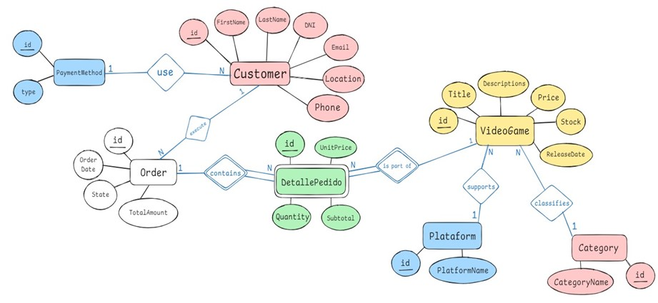

# 
Entrega de proyecto final - GameHub - Video Game Ecommerce Database

@Alumno: Lautaro Santillan

@Comision: 59410

@Tutor: Melina Solorzano

@Docente: Anderson Michel Torres

---

### **Consignas:**
    
- El documento debe contener:
    - Introducción
    - Objetivo
    - Situación problemática
    - Modelo de negocio
    - Diagrama de entidad relación
    - Listado de tablas con descripción de estructura (columna,descripción, tipo de datos, tipo de clave)
    - Scripts de creación de cada objeto de la base de datos
    - Scripts de inserción de datos
    - Informes generados en base a la información de la base
    - Herramientas y tecnologías usadas

---

## Tematica del proyecto
El proyecto aborda el diseño y desarrollo de una base de datos para GameHub, un ecommerce especializado en la venta de videojuegos. La base de datos está diseñada para gestionar de manera eficiente la información clave, incluyendo productos (videojuegos), clientes, pedidos, plataformas, y categorías de videojuegos.

## Modelo de negocio
GameHub es un ecommerce dedicado a la venta de videojuegos para diversas consolas y PC, ofreciendo una amplia gama de títulos en distintas categorías y plataformas. El modelo de negocio de GameHub es de tipo B2C, ya que los clientes pueden comprar productos directamente desde la página web, sin la necesidad de un intermediario.

## Diagrama Entidad-Relación (DER)

## Listado de tablas y descripcion
### PaymentMethod
| Column Name      | Data Type   | Description                             |
|------------------|-------------|-----------------------------------------|
| ID_PaymentMethod | INT         | Primary key. Unique identifier for the payment method. |
| Type             | VARCHAR(50) | Type of payment method (e.g., Credit Card, PayPal).   |

### Customer
| Column Name      | Data Type   | Description                              |
|------------------|-------------|------------------------------------------|
| ID_Customer      | INT         | Primary key. Unique identifier for the customer. |
| FirstName        | VARCHAR(75) | Customer's first name.                    |
| LastName         | VARCHAR(75) | Customer's last name.                     |
| DNI              | INT         | Unique identifier (DNI) for the customer. |
| Email            | VARCHAR(100)| Customer's email address.                 |
| Location         | VARCHAR(100)| Customer's location or address.           |
| Phone            | VARCHAR(20) | Customer's phone number.                  |
| ID_PaymentMethod | INT         | Foreign key referencing PaymentMethod.    |

### Order
| Column Name      | Data Type   | Description                              |
|------------------|-------------|------------------------------------------|
| ID_Order         | INT         | Primary key. Unique identifier for the order. |
| OrderDate        | DATE        | Date the order was placed.               |
| State            | ENUM        | Order status (Pending, Delivered).       |
| TotalAmount      | DECIMAL(10,2)| Total amount of the order.              |
| ID_Customer      | INT         | Foreign key referencing Customer.        |

### Platform
| Column Name      | Data Type   | Description                              |
|------------------|-------------|------------------------------------------|
| ID_Platform      | INT         | Primary key. Unique identifier for the platform. |
| PlatformName     | VARCHAR(15) | Name of the platform (e.g., PC, PlayStation). |

### Category
| Column Name      | Data Type   | Description                              |
|------------------|-------------|------------------------------------------|
| ID_Category      | INT         | Primary key. Unique identifier for the category. |
| CategoryName     | VARCHAR(50) | Name of the category (e.g., Action, RPG). |

### VideoGame
| Column Name      | Data Type   | Description                              |
|------------------|-------------|------------------------------------------|
| ID_VideoGame     | INT         | Primary key. Unique identifier for the video game. |
| Title            | VARCHAR(100)| Title of the video game.                 |
| Descriptions     | VARCHAR(150)| Short description of the video game.     |
| ReleaseDate      | DATE        | Release date of the video game.          |
| Price            | DECIMAL(10,2)| Price of the video game.                |
| Stock            | INT         | Number of units in stock.                |
| ID_Platform      | INT         | Foreign key referencing Platform.        |
| ID_Category      | INT         | Foreign key referencing Category.        |

### OrderDetail
| Column Name      | Data Type   | Description                              |
|------------------|-------------|------------------------------------------|
| ID_OrderDetail   | INT         | Primary key. Unique identifier for the order detail. |
| ID_Order         | INT         | Foreign key referencing Order.           |
| ID_VideoGame     | INT         | Foreign key referencing VideoGame.       |
| Quantity         | INT         | Quantity of the video game in the order. |
| UnitPrice        | DECIMAL(10,2)| Unit price of the video game.           |
| Subtotal         | DECIMAL(10,2)| Calculated as Quantity * UnitPrice.     |

### StockAudit
| Column Name      | Data Type   | Description                              |
|------------------|-------------|------------------------------------------|
| ID_Audit         | INT         | Primary key. Unique identifier for the order detail. |
| ID_VideoGame     | INT         | Foreign key referencing VideoGame.       |
| DateStUp         | DATETIME    | Date of the stock update.                |
| OldStock         | INT         | Stock of the video game before audit.    |
| NewStock         | INT         | Stock of the video game after audit.     |

## Estructura e ingesta de datos
* Se realiza inicialmente por medio del archivo population.sql
* En una segunda insercion de datos, se realiza por medio de la importacion de archivos '.csv' a traves del asistente de Workbench MYSQL